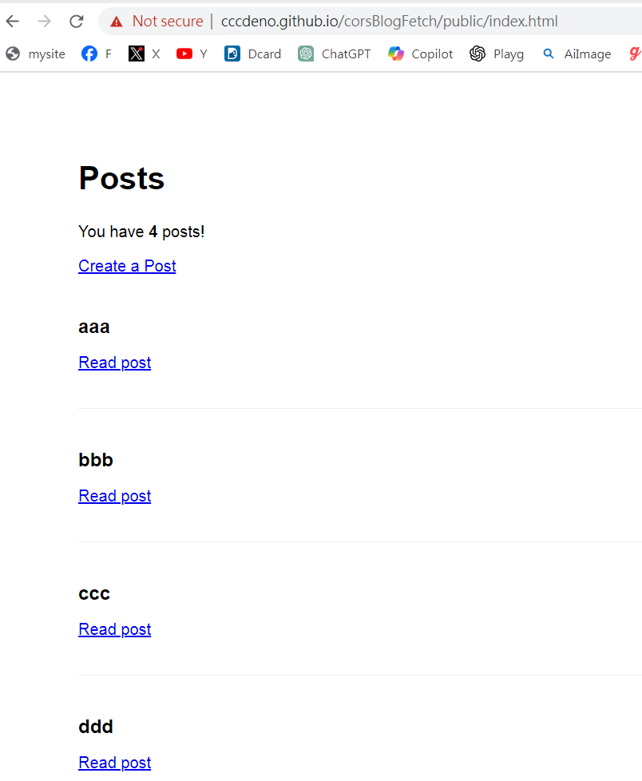
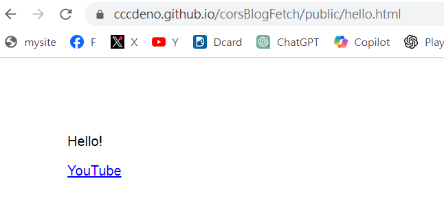

# Blog -- CORS 版

## 首先得再

本站存取 172.104.100.202 將本程式執行起來

```
$ deno run -A app.js
```

## 結果

* https://172.104.100.202:8001/public/index.html

CORS 存取

* https://cccdeno.github.io/corsBlogFetch/public/index.html

瀏覽器還是認為這不安全，但可以執行！



不過如果瀏覽靜態網頁，則沒有被認為不安全

* https://cccdeno.github.io/corsBlogFetch/public/hello.html



## bug

* https://github.com/FiloSottile/mkcert

在 localhost run 時會出現

```
$ deno run -A app.js
CORS-enabled origin :  *
Server run at https://localhost:8001
[uncaught application error]: Http - error writing a body to connection: received fatal alert: CertificateUnknown: received fatal alert: CertificateUnknown

    at async HttpConn.nextRequest (ext:deno_http/01_http.js:108:21)
    at async serve (https://deno.land/x/oak@v11.1.0/http_server_native.ts:112:34)
[uncaught application error]: Http - error writing a body to connection: received fatal alert: CertificateUnknown: received fatal alert: CertificateUnknown
```

在 linode 時也會

```
root@fqdn:~/corsBlogFetch# deno run -A app.js
CORS-enabled origin :  *
Server run at https://localhost:8001
TLS alert received: AlertMessagePayload {
    level: Fatal,
    description: CertificateUnknown,
}
TLS alert received: AlertMessagePayload {
    level: Fatal,
    description: CertificateUnknown,
}
```

在 https://github.com/denoland/deno/issues/18217 這篇文章中，建議用下列方式解決

* bartlomieju commented on Mar 16
    * I believe you should be able to disable it with --unsafely-ignore-certificate-errors
    * 但我測試無效
* jiawei397 commented on Mar 18
    * Local development uses mkcert to solve this problem, so close it. Everyone who need it can also use it , very good.
    * 尚未測試